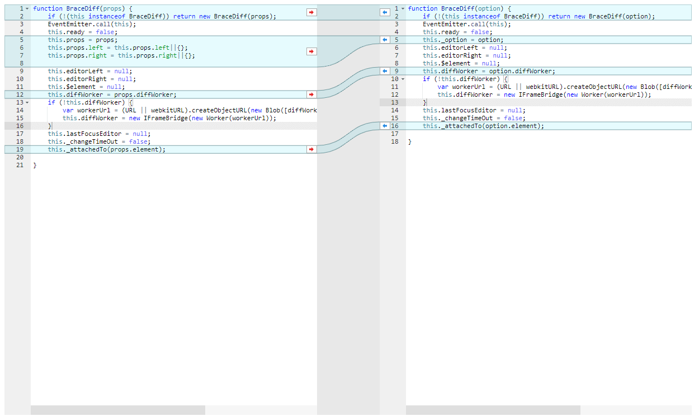

# AbsolBrace

## setup for webpack

```bash
    npm i --save absol-brace
```

## BraceDiff

`main.js`
```js
import AbsolBrace from "absol-brace";
var differ = AbsolBrace.BraceDiff({
            element: '.test0',//required
            option: {
                mode: 'ace/mode/javascript'
            },
            left: {
                value:'function BraceDiff(props) {\r\n    if (!(this instanceof BraceDiff)) return new BraceDiff(props);\r\n    EventEmitter.call(this);\r\n ...'
            },
            right: {
                value: 'function BraceDiff(option) {\r\n    if (!(this instanceof BraceDiff)) return new BraceDiff(option);\r\n    EventEmitter.call(this);\r\n   ...\r\n\r\n}'
            }
        }); 

```

`index.html`
```html
<script src="./dist/absol-brace.js"></script>
<script src="./dist/main.js"></script>
<style>
    .test0 {
        height: 80%;
        background-color: rgba(230, 230, 230, 0.9)
    }
</style>
<div class="test0"></div>

```


[](https://volcanion.cf/absol-brace/)

